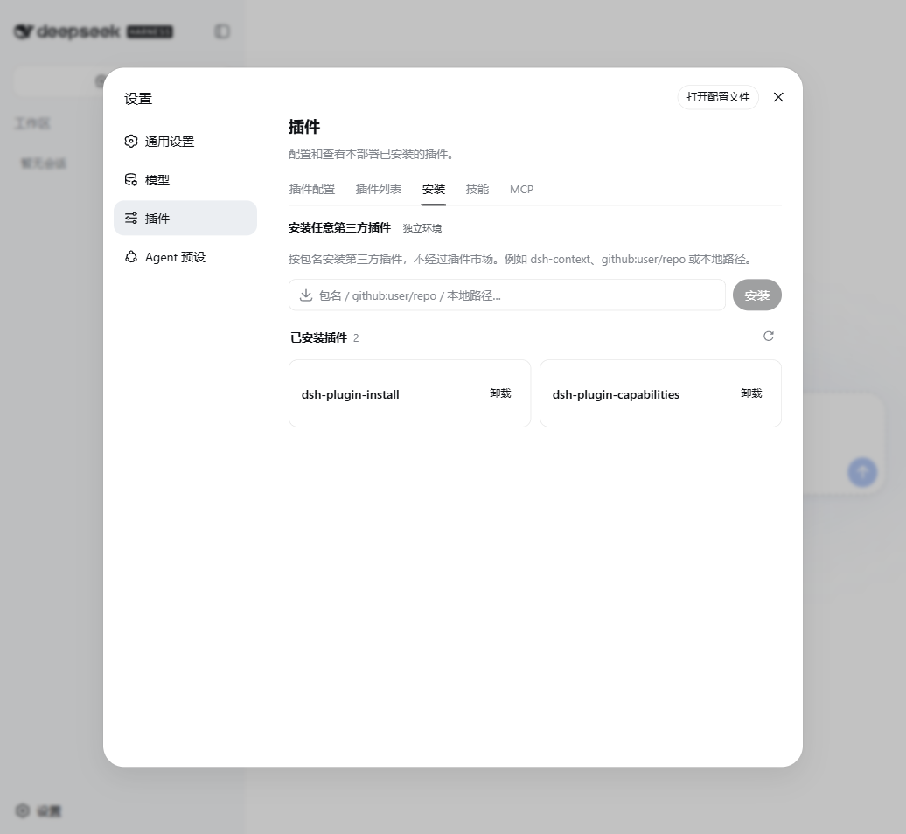

# dsh-plugin-install

[](https://www.npmjs.com/package/dsh-plugin-install)
[](./LICENSE)

在 dsh 设置页里安装任意第三方插件的「安装」标签页。输入包名——npm spec、`github:user/repo` 或本地路径——即可安装，不必开终端，也不必经过插件市场；市场没收录的插件同样能装。



安装和卸载走的都是 `dsh plugin add / remove` 这条 CLI 路径，与命令行完全一致，`dsh.profile.bundles` 的同步由 CLI 负责，不存在第二套状态。装好之后，纯客户端插件刷新页面即可生效；组合较复杂的插件会明确提示需要重启。

## 安装

```sh
dsh plugin --profile web add dsh-plugin-install
```

打开 Web UI 的 设置 → 插件，即可看到「安装」标签页。卸载在同一页面完成，或执行：

```sh
dsh plugin --profile web remove dsh-plugin-install
```

开发时也可以直接安装本地源码检出：`dsh plugin --profile web add file:/path/to/dsh-plugin-install`，包内的 `prepare` 脚本会自动构建出 `lib/`。

## 安全

写操作设有三重防护：spec 采用字符白名单校验，拒绝参数注入与 shell 元字符（如首字符 `-`、分号、重定向符）；POST 请求要求同源；同一时刻仅允许一个安装或卸载操作运行。服务本身只绑定回环地址，上述措施构成纵深防御。

## 在 DSH Desktop 中

桌面客户端 [DSH Desktop](https://github.com/qinyre/dsh-Desktop) 开箱预装了这个插件，无需手动安装。需要重启的操作在桌面内由壳层统一执行，插件不会绕开监督自行重启进程。

## 开发

```sh
npm install
npm run typecheck
npm test
npm run build
```

端到端 smoke 默认关闭，要求同级目录下存在 [deepseek-harness](https://github.com/deepseek-ai/deepseek-harness) 源码检出，且 Node ≥ 22.19：

```sh
DSH_DESKTOP_PLUGIN_SMOKE=1 npm test
```

它会创建临时 `DSH_HOME`，将本插件安装进 `web` profile，启动 `dsh web`，并对安装、卸载、取消等路由逐一探测。

## 许可

[MIT](./LICENSE)
